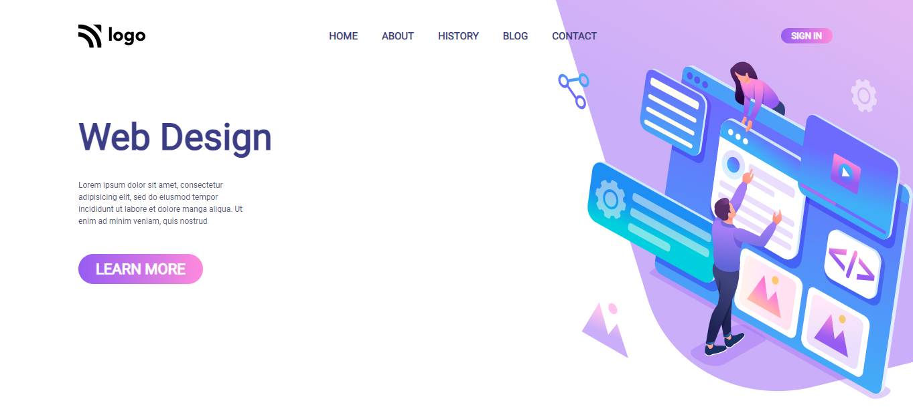

## 🔗Project Link
https://html5-css3-project-08.netlify.app/

## ✨ Project-8: Web Design Landing Page ✨

This assignment is written in **HTML5 and CSS3** which is given in **"JavaScript Full Stack Web Developer Bootcamp"** by **iNeuron**.

 

 

 

## 📌 Screenshot

 

## 📌 What I Learn
    👉 Structuring HTML and CSS.
    👉 Positions in CSS.
    👉 Various CSS Selectors like child selector, pseudo selector, nth-child selector, etc.
    👉 Flexbox in CSS.
    👉 Margin and Padding in CSS.
    👉 Putting background image by using after or before pseudo selector.

## I took 3 hours to complete this project and I really enjoyed it 😊.

## 💬 Connect With Me

- **LinkedIn** - https://www.linkedin.com/in/vishal-kumar-909758228/
- **Instagram** - https://www.instagram.com/_visshal_yadav/

## 📌 Acknowledgments

- Course Instructor - [Hitesh Choudhary](https://github.com/hiteshchoudhary)
